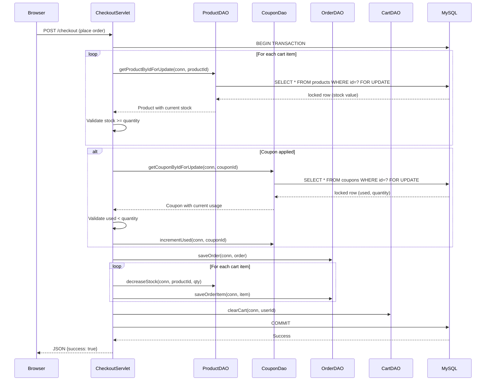
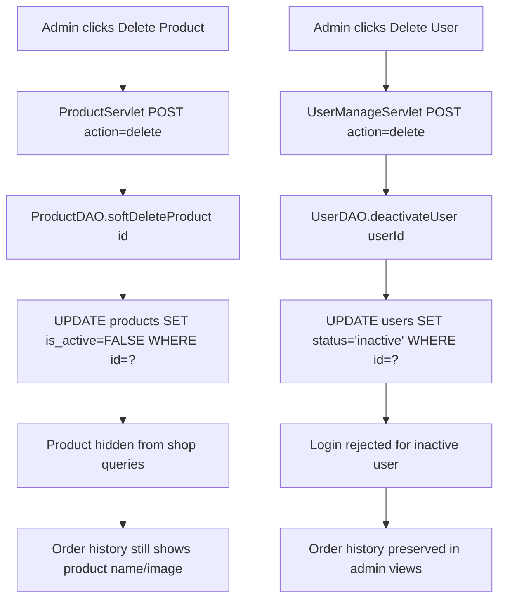

# Design Document: Concurrency & Data Integrity

## Overview

This design addresses six concurrency and data integrity vulnerabilities in the PetShop application, plus a performance indexing requirement. The current codebase has race conditions in checkout stock validation and coupon redemption, allows unverified product reviews, uses destructive hard deletes for products and users (breaking referential integrity with orders/reviews), and lacks database indexes on frequently queried columns.

The approach follows the existing codebase patterns — Jakarta EE Servlets, DAO layer with `java.sql.Connection`, MySQL/InnoDB transactions — and introduces pessimistic row-level locking (`SELECT ... FOR UPDATE`) within the existing `CheckoutServlet` transaction, following the proven pattern already used in `OrderDAO.updateStatus`.

### Key Design Decisions

1. **Pessimistic locking over optimistic locking**: The checkout flow already uses `conn.setAutoCommit(false)` with explicit commit/rollback. Adding `SELECT ... FOR UPDATE` within this transaction is the simplest, lowest-risk change. Optimistic locking (version columns) would require schema changes across multiple tables and retry logic in the servlet layer.

2. **Soft delete via status flags**: Both products and users already have patterns for status-based filtering (`pet_types.is_active`, `users.status`). Extending this to products with `is_active` and leveraging the existing `users.status = 'inactive'` is consistent with the codebase.

3. **DB-authoritative cart**: The `CartDAO.getCartByUserId` method already loads from the database and cleans up stale entries. The change is to ensure this is always called before rendering or checking out, rather than relying on the session cache.

4. **Foreign key constraint changes**: Switching from `ON DELETE CASCADE` to `ON DELETE RESTRICT` on order_items, reviews, cart, and orders foreign keys prevents accidental data loss when soft delete is the intended path.

## Architecture

The changes are scoped to the existing DAO and Servlet layers. No new architectural components are introduced.



### Soft Delete Flow



## Components and Interfaces

### Modified DAO Methods

#### ProductDAO

```java
/**
 * Acquires a row-level lock on the product within an existing transaction.
 * Used during checkout to prevent concurrent stock reads.
 */
public Product getProductByIdForUpdate(Connection conn, int id);

/**
 * Sets is_active = FALSE instead of deleting the row.
 * Preserves referential integrity with orders and reviews.
 */
public boolean softDeleteProduct(int id);

/**
 * All customer-facing queries add WHERE is_active = TRUE (or is_active != 0).
 * Admin queries may include inactive products when needed.
 */
// Modified: getAllProducts, searchProducts, getProductsByPetType,
//           getProductsByCategory, getRelatedProducts, getDiscountedProductsList,
//           and all paginated variants.
```

#### CouponDao

```java
/**
 * Acquires a row-level lock on the coupon within an existing transaction.
 * Returns the coupon with current used/quantity values under lock.
 */
public Coupon getCouponByIdForUpdate(Connection conn, int couponId);
```

#### ReviewDAO

```java
/**
 * Checks if the user has a completed order containing the specified product.
 * Queries order_items JOIN orders WHERE user_id=? AND product_id=? AND status='Completed'.
 */
public boolean hasUserPurchasedProduct(int userId, int productId);
```

#### UserDAO

```java
/**
 * Sets status = 'inactive' instead of deleting the row.
 * Preserves order history, reviews, and audit trails.
 */
public boolean deactivateUser(int userId);
```

#### CartDAO

No new methods needed. The existing `getCartByUserId` already loads from DB and cleans stale entries. The change is in the calling servlets to always invoke this before rendering.

### Modified Servlets

#### CheckoutServlet

- In `placeOrderWithStockCheck`: Replace `productDAO.getProductById(conn, id)` with `productDAO.getProductByIdForUpdate(conn, id)` to acquire row locks before stock validation.
- Add `SELECT ... FOR UPDATE` on coupon row before calling `increaseUsedIfAvailable`.
- The existing transaction boundary (`conn.setAutoCommit(false)` ... `conn.commit()`) remains unchanged.

#### CartServlet

- In `showCart`: Already loads from DB for logged-in users. Verify the flow always calls `cartDAO.getCartByUserId` before rendering (current code does this).
- The `writeCartState` method already reloads from DB for logged-in users.

#### AddReviewServlet

- Add a call to `reviewDAO.hasUserPurchasedProduct(userId, productId)` before `addReview`.
- Reject with error message if no verified purchase exists.

#### ProductDetailServlet

- Add a call to `reviewDAO.hasUserPurchasedProduct(userId, productId)` and pass `hasPurchased` attribute to JSP for conditional review form display.

#### Admin ProductServlet

- Change `deleteProduct` action to call `productDAO.softDeleteProduct(id)` instead of `productDAO.deleteProduct(id)`.

#### Admin UserManageServlet

- Change `delete` action to call `userDAO.deactivateUser(userId)` instead of `userDAO.deleteUser(userId)`.

#### LoginServlet

- After successful credential verification, check if `user.getStatus()` indicates inactive. If so, reject login with a deactivation message.

### Database Schema Changes

All changes are delivered as a single SQL migration script.

## Data Models

### Products Table — New Column

```sql
ALTER TABLE products ADD COLUMN IF NOT EXISTS is_active TINYINT(1) NOT NULL DEFAULT 1;
```

The `Product` Java model already has all needed fields. A new `isActive` boolean field and getter/setter will be added.

### Foreign Key Constraint Changes

Current state → Target state:

| Table.Column | Current FK Action | Target FK Action |
|---|---|---|
| `order_items.product_id` | `ON DELETE CASCADE` | `ON DELETE RESTRICT` |
| `reviews.product_id` | `ON DELETE CASCADE` | `ON DELETE RESTRICT` |
| `orders.user_id` | `ON DELETE CASCADE` | `ON DELETE RESTRICT` |
| `cart.user_id` | `ON DELETE CASCADE` | `ON DELETE RESTRICT` |
| `reviews.user_id` | `ON DELETE CASCADE` | `ON DELETE RESTRICT` |

Implementation: Drop existing foreign keys, re-add with `ON DELETE RESTRICT`.

### New Indexes

```sql
CREATE INDEX idx_orders_user_id ON orders(user_id);
CREATE INDEX idx_orders_created_at ON orders(created_at);
CREATE INDEX idx_orders_status ON orders(status);
CREATE INDEX idx_order_items_order_id ON order_items(order_id);
CREATE INDEX idx_order_items_product_id ON order_items(product_id);
CREATE INDEX idx_reviews_product_id ON reviews(product_id);
CREATE INDEX idx_reviews_user_id ON reviews(user_id);
CREATE INDEX idx_products_pet_type_id ON products(pet_type_id);
CREATE INDEX idx_products_category ON products(category);
CREATE INDEX idx_cart_user_id ON cart(user_id);
```

Note: Some of these may already exist as part of foreign key definitions. The migration script will use `CREATE INDEX IF NOT EXISTS` or check `information_schema` before creating.

### User Model

The `User` model already has a `status` field (mapped from `users.status` varchar column with values `'active'`/`'inactive'`). The existing `UserDAO.mapUser` reads status as a boolean. The `deactivateUser` method will set `status = 'inactive'`, and the login check will verify `status = 'active'` before allowing authentication.


## Correctness Properties

*A property is a characteristic or behavior that should hold true across all valid executions of a system — essentially, a formal statement about what the system should do. Properties serve as the bridge between human-readable specifications and machine-verifiable correctness guarantees.*

### Property 1: Stock validation and decrement correctness

*For any* product with initial stock S and requested checkout quantity Q: if Q ≤ S, then `decreaseStock` succeeds and the resulting stock equals S − Q (with S − Q ≥ 0); if Q > S, then the operation is rejected and the stock remains S.

**Validates: Requirements 1.2, 1.3, 1.4**

### Property 2: Cart cleanup removes invalid entries and clamps quantities

*For any* cart loaded from the database containing entries with various product states (product deleted, product stock = 0, cart quantity > product stock, normal), the `getCartByUserId` cleanup logic shall: remove entries whose product no longer exists or has zero stock, and clamp remaining entry quantities to be at most the current product stock (and at least 1).

**Validates: Requirements 2.4**

### Property 3: Coupon validation and increment correctness

*For any* coupon with current `used` count U and `quantity` limit Q: if U < Q, then `increaseUsedIfAvailable` succeeds and the resulting `used` equals U + 1 (with U + 1 ≤ Q); if U ≥ Q, then the redemption is rejected and `used` remains U.

**Validates: Requirements 3.2, 3.3, 3.5**

### Property 4: Review submission requires verified purchase

*For any* (userId, productId) pair, the review submission shall succeed only if there exists a completed order (`status = 'Completed'`) placed by that user containing that product in its order items. If no such order exists, the review shall be rejected.

**Validates: Requirements 4.1, 4.3**

### Property 5: Product soft delete preserves row with inactive flag

*For any* product that exists in the database, after calling `softDeleteProduct`, the product row shall still exist with `is_active = FALSE`, and all other column values shall remain unchanged.

**Validates: Requirements 5.2**

### Property 6: Inactive products excluded from customer-facing queries

*For any* set of products with mixed `is_active` values, all customer-facing query methods (`getAllProducts`, `searchProducts`, `getProductsByPetType`, `getProductsByCategory`, `getRelatedProducts`, `getDiscountedProductsList`, and paginated variants) shall return only products where `is_active = TRUE`.

**Validates: Requirements 5.3**

### Property 7: Order history preserves inactive product data

*For any* order containing items that reference products with `is_active = FALSE`, the `getOrderItems` method shall still return the product name and image for those items.

**Validates: Requirements 5.4**

### Property 8: User deactivation preserves row with inactive status

*For any* user that exists in the database, after calling `deactivateUser`, the user row shall still exist with `status = 'inactive'`, and all other column values shall remain unchanged.

**Validates: Requirements 6.1**

### Property 9: Login rejects inactive users

*For any* user with `status = 'inactive'`, login attempts with correct credentials shall be rejected. *For any* user with `status = 'active'`, login attempts with correct credentials shall succeed.

**Validates: Requirements 6.2**

### Property 10: Admin order views preserve inactive user orders

*For any* order placed by a user who is subsequently deactivated (`status = 'inactive'`), the `getAllOrders` and `getOrdersByUserId` methods shall still return that order with correct data.

**Validates: Requirements 6.3**

## Error Handling

### Checkout Stock Errors

When a `SELECT ... FOR UPDATE` reveals insufficient stock during checkout:
1. The transaction is rolled back via `conn.rollback()`.
2. A JSON response is returned: `{success: false, message: "Sản phẩm \"<name>\" chỉ còn <stock> sản phẩm."}`.
3. The cart and session state remain unchanged (no partial order created).

This follows the existing error handling pattern in `CheckoutServlet.placeOrderWithStockCheck`.

### Checkout Coupon Errors

When a `SELECT ... FOR UPDATE` reveals the coupon is fully redeemed:
1. The transaction is rolled back.
2. A JSON response is returned: `{success: false, message: "Mã giảm giá đã hết lượt sử dụng."}`.
3. The `appliedCoupon` session attribute is removed.

### Review Rejection

When a user without a verified purchase attempts to submit a review:
1. An error message is set in the session: `"Chỉ khách hàng đã mua và nhận sản phẩm mới có thể đánh giá."`.
2. The user is redirected back to the product detail page.
3. No review row is inserted.

### Soft Delete Constraint Violations

If a hard `DELETE` is attempted on a product or user that has dependent records (orders, reviews), the `ON DELETE RESTRICT` constraint will cause a SQL exception. The DAO methods should catch this and return `false`, and the servlet should display an appropriate error message. However, since the application now uses soft delete, this path should not be reached in normal operation — it serves as a safety net.

### Database Lock Timeouts

If a `SELECT ... FOR UPDATE` blocks for too long (another transaction holds the lock), MySQL's `innodb_lock_wait_timeout` (default 50 seconds) will throw a `LockTimeoutException`. The existing `catch (Exception e)` block in `CheckoutServlet` handles this by rolling back and returning a generic error. No additional handling is needed.

## Testing Strategy

### Unit Tests (Example-Based)

Unit tests cover specific scenarios and integration points:

- **Cart DB-authoritative behavior**: Verify that `showCart` and `writeCartState` call `getCartByUserId` for logged-in users, and use session-only for anonymous users (Requirements 2.1, 2.2, 2.3, 2.5).
- **Review purchase verification query**: Verify that `hasUserPurchasedProduct` correctly queries `order_items JOIN orders` with the right filters (Requirement 4.2).
- **ProductDetailServlet hasPurchased attribute**: Verify the attribute is set on the request (Requirement 4.4).
- **Schema smoke tests**: Verify `is_active` column exists on products, all FK constraints are `RESTRICT`, and all 10 indexes exist (Requirements 5.1, 5.5, 5.6, 6.4, 6.5, 6.6, 7.1–7.10).

### Integration Tests

Integration tests cover concurrency and database-level behavior:

- **Concurrent stock checkout**: Two threads attempt to purchase the same product with combined quantity exceeding stock. Verify exactly one succeeds (Requirement 1.5).
- **Concurrent coupon redemption**: Two threads attempt to redeem the same coupon with one use remaining. Verify exactly one succeeds (Requirement 3.4).
- **Lock acquisition verification**: Verify that checkout SQL includes `FOR UPDATE` on product and coupon rows (Requirements 1.1, 3.1).

### Property-Based Tests

Property-based tests verify universal correctness properties across generated inputs. Each property test runs a minimum of 100 iterations.

The project uses Java with Maven. Property-based tests will use **jqwik** (a JUnit 5-compatible PBT library for Java) for property generation and shrinking.

Each property test is tagged with a comment referencing the design property:
- Tag format: **Feature: concurrency-data-integrity, Property {number}: {property_text}**

Properties to implement:
1. Stock validation and decrement correctness (Property 1)
2. Cart cleanup removes invalid entries and clamps quantities (Property 2)
3. Coupon validation and increment correctness (Property 3)
4. Review submission requires verified purchase (Property 4)
5. Product soft delete preserves row (Property 5)
6. Inactive products excluded from customer queries (Property 6)
7. Order history preserves inactive product data (Property 7)
8. User deactivation preserves row (Property 8)
9. Login rejects inactive users (Property 9)
10. Admin order views preserve inactive user orders (Property 10)
