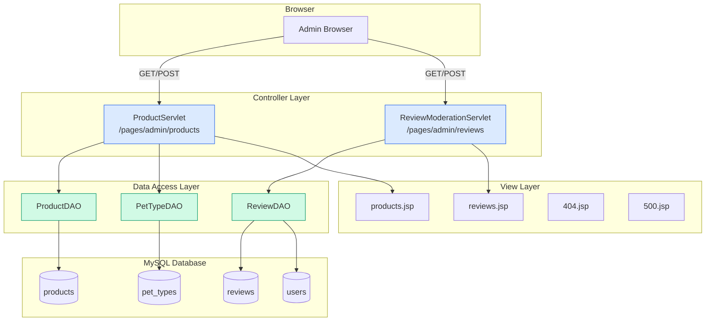

# Design Document: PetShop Admin Completion

## Overview

This design covers three features to complete the PetShop admin panel:

1. **Enhanced Product Management** — Extend the existing `ProductServlet` and `products.jsp` to support `stock`, `weight`, `category`, and `pet_type_id` fields in add/edit forms and the product list table.
2. **Review Moderation** — New `ReviewModerationServlet` and `reviews.jsp` for admins to view all reviews, filter by rating, and delete violating reviews. New DAO methods in `ReviewDAO`.
3. **Custom Error Pages** — Branded 404 and 500 error pages declared in `web.xml`, with conditional admin dashboard link.

All changes follow the existing project conventions: Java Servlet (Jakarta EE), JSP with JSTL, MySQL via `DBContext`, and the shared admin UI component library (`admin-styles.jsp`, `admin-sidebar.jsp`).

---

## Architecture

The system follows the existing MVC pattern already established in the PetShop project:



**Key architectural decisions:**

- **No new models needed.** The `Product` model already has `stock`, `weight`, `category`, `pet_type_id` fields. The `Review` model already has `productName` field.
- **New DAO methods only.** `ProductDAO` gets overloaded `addProduct`/`updateProduct` with extra parameters. `ReviewDAO` gets `getAllReviews()`, `getReviewsByMaxRating()`, `deleteReview()`.
- **New servlet for reviews.** A dedicated `ReviewModerationServlet` keeps review moderation logic separate from the existing `AddReviewServlet` (customer-facing).
- **Error pages are standalone JSPs.** They include `meta.jsp` and `head.jsp` for branding but deliberately exclude `navbar.jsp` and `footer.jsp` to avoid cascading errors when the app is in a broken state.

---

## Components and Interfaces

### 1. ProductDAO — New Method Overloads

```java
// New overload: add product with all fields
public boolean addProduct(String name, String image, double price, int discount,
                          String description, int stock, int weight,
                          String category, int petTypeId)

// New overload: update product with all fields
public boolean updateProduct(int id, String name, String image, double price, int discount,
                             String description, int stock, int weight,
                             String category, int petTypeId)
```

The existing 5-parameter `addProduct` and 6-parameter `updateProduct` remain unchanged for backward compatibility. The new overloads add `stock`, `weight`, `category`, `petTypeId` to the SQL INSERT/UPDATE statements.

### 2. ReviewDAO — New Methods

```java
// Get all reviews with user fullname and product name, ordered by created_at DESC
public List<Review> getAllReviews()

// Get reviews where rating <= maxRating, with user fullname and product name
public List<Review> getReviewsByMaxRating(int maxRating)

// Delete a review by ID, returns true if a row was deleted
public boolean deleteReview(int reviewId)
```

**SQL for `getAllReviews()`:**
```sql
SELECT r.*, u.fullname, p.name AS product_name
FROM reviews r
JOIN users u ON r.user_id = u.id
JOIN products p ON r.product_id = p.id
ORDER BY r.created_at DESC
```

**SQL for `getReviewsByMaxRating()`:**
```sql
SELECT r.*, u.fullname, p.name AS product_name
FROM reviews r
JOIN users u ON r.user_id = u.id
JOIN products p ON r.product_id = p.id
WHERE r.rating <= ?
ORDER BY r.created_at DESC
```

### 3. ProductServlet — Enhanced doGet and doPost

**doGet changes:**
- Load `PetTypeDAO.getAllPetTypes()` and set as request attribute `petTypes`.

**doPost changes (add/edit actions):**
- Parse new parameters: `stock`, `weight`, `category`, `petTypeId`.
- Validate `stock` is a non-negative integer; reject with error "Tồn kho phải là số nguyên không âm." if invalid.
- Validate `weight` is a non-negative integer; reject with error "Trọng lượng phải là số nguyên không âm (gram)." if invalid.
- Call the new overloaded `addProduct`/`updateProduct` with all parameters.

### 4. ReviewModerationServlet — New Servlet

```java
@WebServlet("/pages/admin/reviews")
public class ReviewModerationServlet extends HttpServlet {

    // GET: load reviews (optionally filtered by maxRating query param)
    protected void doGet(HttpServletRequest request, HttpServletResponse response)

    // POST: handle action=delete with reviewId parameter
    protected void doPost(HttpServletRequest request, HttpServletResponse response)
}
```

**doGet flow:**
1. Check admin session (redirect to login if not admin).
2. Read optional `maxRating` query parameter.
3. If `maxRating` is present and valid, call `ReviewDAO.getReviewsByMaxRating(maxRating)`.
4. Otherwise, call `ReviewDAO.getAllReviews()`.
5. Set `reviews` attribute, forward to `/pages/admin/reviews.jsp`.

**doPost flow:**
1. Check admin session.
2. Read `action` parameter. If `"delete"`, read `reviewId`.
3. Parse `reviewId` using `ValidationUtil.parseIntOrNull()`.
4. If null or `deleteReview()` returns false, set error message "Review không tồn tại hoặc đã bị xóa.".
5. Otherwise, set success message.
6. Redirect to `/pages/admin/reviews`.

### 5. JSP Views

**products.jsp changes:**
- Add `stock`, `weight`, `category`, `pet_type_id` fields to the add/edit modal form.
- Add `<select>` dropdown for `pet_type_id` populated from `${petTypes}`.
- Add `stock` and `category` columns to the product table.
- Show "Hết hàng" badge when `stock == 0`.
- Add `data-stock`, `data-weight`, `data-category`, `data-pet-type-id` attributes to table rows for edit modal pre-fill.

**reviews.jsp (new):**
- Include shared admin components: `admin-sidebar.jsp`, `admin-styles.jsp`, `admin-header-dropdown.jsp`, `admin-toast.jsp`.
- Stats cards: total reviews, average rating, low-rating count.
- Filter bar with `<select>` for maxRating (Tất cả, ≤ 1 sao, ≤ 2 sao, ≤ 3 sao).
- Table columns: #, Product Name, User Name, Rating (star icons), Comment, Date, Actions (delete button).
- Delete confirmation modal (same pattern as products.jsp delete modal).

**404.jsp and 500.jsp (new):**
- Standalone pages with `meta.jsp` + `head.jsp` includes only.
- Centered layout with pet-themed icon (Boxicons `bx-error` / `bx-error-circle`).
- Vietnamese error message.
- "Về trang chủ" link to `/home`.
- Conditional "Về Admin Dashboard" link when request URI starts with `/pages/admin/`.

### 6. web.xml — Error Page Declarations

```xml
<error-page>
    <error-code>404</error-code>
    <location>/pages/error/404.jsp</location>
</error-page>
<error-page>
    <error-code>500</error-code>
    <location>/pages/error/500.jsp</location>
</error-page>
```

### 7. admin-sidebar.jsp — New Link

Add a "Quản lý Review" link in the "Thương mại" section, after "Quản lý Đơn hàng":

```html
<a href="${pageContext.request.contextPath}/pages/admin/reviews"
   class="<%= "reviews".equals(currentPage) ? "active" : "" %>">
    <i class='bx bxs-star-half'></i> Quản lý Review
</a>
```

---

## Data Models

No new database tables or model classes are needed. All required fields already exist:

### products table (existing columns used)

| Column | Type | Notes |
|--------|------|-------|
| id | int, PK, AUTO_INCREMENT | |
| name | varchar(255) | |
| image | varchar(255) | |
| price | decimal(18,0) | |
| discount | int | 0–100 |
| description | text | |
| category | varchar(100) | Already exists via ALTER TABLE in db.sql |
| stock | int, DEFAULT 100 | Already exists via ALTER TABLE in db.sql |
| pet_type_id | int, FK → pet_types(id) | Already exists via ALTER TABLE in db.sql |
| weight | — | **Not in db.sql schema.** Needs `ALTER TABLE products ADD COLUMN weight int DEFAULT 0;` |

**Note:** The `Product` model has a `weight` field and `ProductDAO.mapProduct()` already reads it with a try-catch, but the `products` table in `db.sql` does not include a `weight` column in the ALTER TABLE statement. An SQL migration is needed:

```sql
ALTER TABLE products ADD COLUMN IF NOT EXISTS weight int DEFAULT 0;
```

### reviews table (existing)

| Column | Type | Notes |
|--------|------|-------|
| id | int, PK | |
| product_id | int, FK → products(id) | |
| user_id | int, FK → users(id) | |
| rating | int | 1–5 |
| comment | text | |
| created_at | timestamp | DEFAULT CURRENT_TIMESTAMP |

### Review model (existing)

The `Review` model already has `productName` field with getter/setter. The new `getAllReviews()` and `getReviewsByMaxRating()` methods will populate it from the JOIN query.

---

## Correctness Properties

*A property is a characteristic or behavior that should hold true across all valid executions of a system — essentially, a formal statement about what the system should do. Properties serve as the bridge between human-readable specifications and machine-verifiable correctness guarantees.*

### Property 1: Product add round-trip

*For any* valid product data (name, image, price, discount, description, stock ≥ 0, weight ≥ 0, category, petTypeId), adding the product via `ProductDAO.addProduct()` and then retrieving it by ID should return a product where all nine fields match the original input values.

**Validates: Requirements 1.4, 1.10**

### Property 2: Product update round-trip

*For any* existing product and *any* valid updated product data (name, image, price, discount, description, stock ≥ 0, weight ≥ 0, category, petTypeId), updating the product via `ProductDAO.updateProduct()` and then retrieving it by ID should return a product where all fields match the updated input values.

**Validates: Requirements 1.5, 1.11**

### Property 3: Non-negative integer field validation

*For any* input string that does not represent a non-negative integer (negative numbers, decimal numbers, non-numeric strings, empty strings), the ProductServlet validation logic should reject the request and the product list should remain unchanged.

**Validates: Requirements 1.6, 1.7**

### Property 4: Rating filter correctness

*For any* set of reviews in the database and *any* maxRating value between 1 and 5, `ReviewDAO.getReviewsByMaxRating(maxRating)` should return exactly the reviews whose rating is ≤ maxRating, and every returned review should have its `userName` and `productName` fields populated (non-null).

**Validates: Requirements 2.4, 2.5**

---

## Error Handling

### ProductServlet Validation Errors

| Condition | Error Message | Behavior |
|-----------|--------------|----------|
| Name empty or null | "Tên sản phẩm không được để trống." | Redirect back with error toast |
| Name length < 2 or > 200 | "Tên sản phẩm phải từ 2-200 ký tự." | Redirect back with error toast |
| Price not positive number | "Giá bán không hợp lệ." / "Giá bán phải lớn hơn 0." | Redirect back with error toast |
| Discount not 0–100 | "Giảm giá phải từ 0-100%." | Redirect back with error toast |
| Stock not non-negative integer | "Tồn kho phải là số nguyên không âm." | Redirect back with error toast |
| Weight not non-negative integer | "Trọng lượng phải là số nguyên không âm (gram)." | Redirect back with error toast |
| Invalid image file type | "Chỉ chấp nhận file ảnh (JPG, PNG, GIF, WebP)!" | Redirect back with error toast |
| DAO operation fails | "Có lỗi xảy ra khi thêm/cập nhật sản phẩm!" | Redirect back with error toast |

### ReviewModerationServlet Errors

| Condition | Error Message | Behavior |
|-----------|--------------|----------|
| Non-admin access | — | Redirect to login page |
| Delete with invalid/non-existent ID | "Review không tồn tại hoặc đã bị xóa." | Redirect back with error toast |
| Invalid maxRating param | — | Ignore filter, show all reviews |

### Error Pages

| HTTP Status | Page | Content |
|-------------|------|---------|
| 404 | `/pages/error/404.jsp` | "Trang không tìm thấy" + homepage link + conditional admin link |
| 500 | `/pages/error/500.jsp` | "Lỗi máy chủ" + homepage link |

All error pages avoid including `navbar.jsp` and `footer.jsp` to prevent cascading errors when the application is in a broken state (e.g., database connection failure causing 500).

---

## Testing Strategy

### Unit Tests (Example-Based)

Since this is a Java Servlet + JSP project without an existing test framework, testing will primarily be manual and integration-based. Key test scenarios:

**Product Management:**
- Add a product with all fields filled → verify it appears in the list with correct stock and category.
- Edit a product, change stock/weight/category/petTypeId → verify changes persist.
- Add a product with stock = 0 → verify "Hết hàng" badge appears.
- Submit add form with negative stock → verify error message "Tồn kho phải là số nguyên không âm."
- Submit add form with negative weight → verify error message "Trọng lượng phải là số nguyên không âm (gram)."
- Verify pet type dropdown is populated with all pet types.

**Review Moderation:**
- Navigate to `/pages/admin/reviews` → verify all reviews are listed with product name, user name, rating, comment, date.
- Apply filter ≤ 2 sao → verify only 1-star and 2-star reviews appear.
- Delete a review → verify it disappears from the list and success message shows.
- Delete with non-existent ID → verify error message.

**Error Pages:**
- Navigate to a non-existent URL → verify 404.jsp renders with PetShop branding.
- Navigate to a non-existent admin URL → verify 404.jsp shows "Về Admin Dashboard" link.
- Trigger a 500 error → verify 500.jsp renders.

### Property-Based Tests

If a test framework (e.g., JUnit + jqwik) is added, the following property tests should be implemented with minimum 100 iterations each:

1. **Feature: petshop-admin-completion, Property 1: Product add round-trip** — Generate random valid product data, add via DAO, retrieve, assert all fields match.
2. **Feature: petshop-admin-completion, Property 2: Product update round-trip** — Generate random valid product data, update existing product via DAO, retrieve, assert all fields match.
3. **Feature: petshop-admin-completion, Property 3: Non-negative integer field validation** — Generate random invalid non-negative integer strings, assert validation rejects them.
4. **Feature: petshop-admin-completion, Property 4: Rating filter correctness** — Generate random review sets with ratings 1–5, apply random maxRating filter, assert returned set matches expected.

### Test Library

For property-based testing in Java: **jqwik** (JUnit 5 compatible PBT library). Each property test should be annotated with `@Property` and configured for `tries = 100` minimum.
