# Design Document: Security Hardening

## Overview

This design hardens the PetShop Jakarta EE application against the most common web-application attack vectors: unauthorized access, brute-force login, session hijacking, CSRF, XSS, automated abuse, and malicious file uploads. Every change is implemented as a servlet filter, a DAO extension, a utility method, or a `web.xml` configuration — no new frameworks are introduced.

The approach follows a **defense-in-depth** strategy: each security layer operates independently so that a bypass in one layer does not compromise the others. All seven requirement areas map to discrete, testable components that integrate with the existing codebase without altering business logic.

### Key Design Decisions

| Decision | Rationale |
|---|---|
| Servlet `@WebFilter` annotations for Admin, CSRF, and Rate Limit filters | Matches the existing `PetTypeFilter` pattern; no `web.xml` filter declarations needed |
| In-memory `ConcurrentHashMap` for rate limiting | Avoids adding Redis/external dependencies; sufficient for single-instance deployment |
| Database columns for brute-force tracking (`failed_login_attempts`, `locked_until`) | Survives server restarts; works across clustered deployments |
| `SecureRandom` for CSRF token generation | Cryptographically strong; available in JDK without extra dependencies |
| Shared `FileUploadValidator` utility | Eliminates duplicated validation logic between `FileUploadServlet` and `ProductServlet` |
| `web.xml` `<session-config>` for timeout and cookie flags | Declarative, container-managed; no code changes needed for session timeout and cookie attributes |

## Architecture

### Component Interaction Diagram

```mermaid
graph TD
    subgraph "Servlet Filter Chain (ordered)"
        A[RateLimitFilter] --> B[AdminAuthFilter]
        B --> C[CsrfFilter]
        C --> D[PetTypeFilter &#40;existing&#41;]
    end

    D --> E[Target Servlet]

    subgraph "Utility Layer"
        F[ValidationUtil &#40;extended&#41;]
        G[FileUploadValidator &#40;new&#41;]
    end

    subgraph "Data Layer"
        H[UserDAO &#40;extended&#41;]
        I[MySQL users table &#40;new columns&#41;]
    end

    E --> F
    E --> G
    E --> H
    H --> I
```



### Request Flow

1. **RateLimitFilter** — checks IP-based request count against per-endpoint limits. Returns 429 if exceeded.
2. **AdminAuthFilter** — for `/pages/admin/*` and `/admin/*` URLs, verifies session contains a user with `role = "admin"`. Redirects to `/login` otherwise. Skips static resources.
3. **CsrfFilter** — on GET requests, generates/refreshes a per-session CSRF token and sets it as a request attribute. On POST requests, validates the submitted token matches the session token. Returns 403 on mismatch. Excludes JSON API endpoints.
4. **PetTypeFilter** (existing, unchanged) — loads pet types for navbar rendering.
5. **Target Servlet** — uses extended `ValidationUtil` for input sanitization and `FileUploadValidator` for upload checks.

### Filter Ordering

Jakarta Servlet spec does not guarantee `@WebFilter` ordering. To enforce the correct chain, all three new filters will be declared in `web.xml` with explicit `<filter-mapping>` ordering, while keeping the `@WebFilter` annotation on `PetTypeFilter` (which runs last and has no ordering dependency).

```xml
<!-- web.xml filter ordering -->
<filter>
    <filter-name>RateLimitFilter</filter-name>
    <filter-class>controller.filter.RateLimitFilter</filter-class>
</filter>
<filter>
    <filter-name>AdminAuthFilter</filter-name>
    <filter-class>controller.filter.AdminAuthFilter</filter-class>
</filter>
<filter>
    <filter-name>CsrfFilter</filter-name>
    <filter-class>controller.filter.CsrfFilter</filter-class>
</filter>

<filter-mapping>
    <filter-name>RateLimitFilter</filter-name>
    <url-pattern>/*</url-pattern>
</filter-mapping>
<filter-mapping>
    <filter-name>AdminAuthFilter</filter-name>
    <url-pattern>/pages/admin/*</url-pattern>
</filter-mapping>
<filter-mapping>
    <filter-name>AdminAuthFilter</filter-name>
    <url-pattern>/admin/*</url-pattern>
</filter-mapping>
<filter-mapping>
    <filter-name>CsrfFilter</filter-name>
    <url-pattern>/*</url-pattern>
</filter-mapping>
```

## Components and Interfaces

### 1. AdminAuthFilter

**Location:** `controller/filter/AdminAuthFilter.java`

```java
public class AdminAuthFilter implements Filter {
    void doFilter(ServletRequest req, ServletResponse res, FilterChain chain);
    boolean isStaticResource(String uri);
}
```

**Behavior:**
- Reads `User` from `session.getAttribute("user")`
- If user is null or `user.getRole()` is not `"admin"`, redirects to `/login`
- Skips static resources: `.css`, `.js`, `.png`, `.jpg`, `.jpeg`, `.gif`, `.ico`, `.woff`, `.woff2`, `.ttf`, `.svg`, `.map`, `.webp`
- Registered via `web.xml` for `/pages/admin/*` and `/admin/*`

### 2. Brute-Force Protection (UserDAO + LoginServlet changes)

**UserDAO new methods:**

```java
public class UserDAO {
    // New methods
    int getFailedLoginAttempts(String emailOrUsername);
    Timestamp getLockedUntil(String emailOrUsername);
    void incrementFailedAttempts(String emailOrUsername);
    void lockAccount(String emailOrUsername, int lockoutMinutes);
    void resetFailedAttempts(String emailOrUsername);
    boolean isAccountLocked(String emailOrUsername);
}
```

**LoginServlet changes:**
- Before password verification, check `isAccountLocked()`. If locked, return error with remaining lockout time.
- On failed login: call `incrementFailedAttempts()`. If count reaches 5, call `lockAccount(emailOrUsername, 15)`.
- On successful login: call `resetFailedAttempts()`.
- Display remaining attempts on failure: `5 - currentFailedAttempts`.

### 3. Session Security (web.xml configuration)

Added to `web.xml`:

```xml
<session-config>
    <session-timeout>30</session-timeout>
    <cookie-config>
        <http-only>true</http-only>
        <secure>true</secure>
    </cookie-config>
</session-config>
```

**LoginServlet session regeneration:**

```java
// On successful login, before storing user in session:
HttpSession oldSession = request.getSession(false);
if (oldSession != null) {
    oldSession.invalidate();
}
HttpSession newSession = request.getSession(true);
newSession.setAttribute("user", user);
```

### 4. CsrfFilter

**Location:** `controller/filter/CsrfFilter.java`

```java
public class CsrfFilter implements Filter {
    void doFilter(ServletRequest req, ServletResponse res, FilterChain chain);
    String generateToken();
    boolean isExcludedFromCsrf(HttpServletRequest request);
    boolean isStaticResource(String uri);
}
```

**Behavior:**
- `generateToken()`: uses `SecureRandom` to produce a 32-byte hex string
- On every request (non-static): if session has no `csrfToken`, generate and store one
- On GET: set `request.setAttribute("csrfToken", sessionToken)` for JSP access
- On POST: compare `request.getParameter("csrfToken")` with session token. If mismatch or missing, return 403.
- Exclude: requests where `Accept` header contains `application/json` or the response content-type is `application/json` (AJAX endpoints like checkout, add-to-cart JSON responses, username check)
- Exclude: static resources

**JSP integration:** Forms add `<input type="hidden" name="csrfToken" value="${csrfToken}" />`

### 5. ValidationUtil Extensions

**New methods added to existing `Util/ValidationUtil.java`:**

```java
public class ValidationUtil {
    // New methods
    static String stripHtmlTags(String input);       // Removes all HTML tags, trims
    static boolean validateMaxLength(String input, int maxLength);  // false if exceeds
}
```

**Servlet integration points:**
- `AddReviewServlet`: call `stripHtmlTags(comment)` then `validateMaxLength(comment, 1000)`
- `CheckoutServlet`: call `validateMaxLength(note, 500)` on order note
- `ShopServlet` / `SearchAutocompleteServlet`: truncate search keyword to 100 chars
- `RegisterServlet` / `MyAccountServlet`: call `validateMaxLength(fullname, 200)`

### 6. RateLimitFilter

**Location:** `controller/filter/RateLimitFilter.java`

```java
public class RateLimitFilter implements Filter {
    void doFilter(ServletRequest req, ServletResponse res, FilterChain chain);
    String resolveClientIp(HttpServletRequest request);
    boolean isRateLimited(String clientIp, String endpoint);
    int getLimitForEndpoint(String path);
    void evictExpiredEntries();
}
```

**Data structure:**

```java
// Key: clientIp + ":" + endpoint
// Value: list of request timestamps within the sliding window
ConcurrentHashMap<String, List<Long>> requestLog;
```

**Per-endpoint limits (requests per 60-second sliding window):**

| Endpoint pattern | Limit |
|---|---|
| `/login` | 10 |
| `/shop` | 30 |
| `/add-to-cart` | 20 |
| `/add-review` | 5 |
| All other endpoints | No limit (pass through) |

**IP resolution:** `request.getRemoteAddr()`, with fallback to `X-Forwarded-For` header (first IP in chain) when present.

**Eviction:** A background `ScheduledExecutorService` runs every 5 minutes to remove entries older than the 60-second window.

### 7. FileUploadValidator

**Location:** `Util/FileUploadValidator.java`

```java
public class FileUploadValidator {
    static boolean isAllowedExtension(String fileName);
    static boolean isContentTypeMatchingExtension(String contentType, String extension);
    static String generateSecureFileName(String originalFileName);
    static ValidationResult validate(Part filePart);
}
```

**Extension whitelist:** `jpg`, `jpeg`, `png`, `gif`, `webp` (case-insensitive)

**Content-Type mapping:**

| Extension | Expected Content-Type |
|---|---|
| `jpg`, `jpeg` | `image/jpeg` |
| `png` | `image/png` |
| `gif` | `image/gif` |
| `webp` | `image/webp` |

**Secure filename:** `UUID.randomUUID() + "_" + System.currentTimeMillis() + "." + validatedExtension`

**Integration:** Both `FileUploadServlet` and `ProductServlet` delegate to `FileUploadValidator.validate(part)` instead of inline validation.

## Data Models

### Database Schema Changes

**ALTER `users` table:**

```sql
ALTER TABLE `users`
    ADD COLUMN `failed_login_attempts` INT NOT NULL DEFAULT 0,
    ADD COLUMN `locked_until` DATETIME NULL DEFAULT NULL;
```

**User model changes (`Model/User.java`):**

```java
// New fields
private int failedLoginAttempts;
private Timestamp lockedUntil;

// + getters and setters
```

### In-Memory Data Structures

**RateLimitFilter request log:**

```
ConcurrentHashMap<String, CopyOnWriteArrayList<Long>>
  Key:   "192.168.1.1:/login"
  Value: [1719000001000, 1719000002000, ...]  // epoch millis
```

**CsrfFilter token storage:** Session attribute `"csrfToken"` (String, 64 hex chars)


## Correctness Properties

*A property is a characteristic or behavior that should hold true across all valid executions of a system — essentially, a formal statement about what the system should do. Properties serve as the bridge between human-readable specifications and machine-verifiable correctness guarantees.*

### Property 1: Admin filter authorization decision

*For any* request URL matching `/pages/admin/*` or `/admin/*` and *for any* session state, the AdminAuthFilter SHALL allow the request to proceed if and only if the session contains a User object with role equal to `"admin"`. In all other cases (no session user, or user with a non-admin role), the filter SHALL redirect to `/login`.

**Validates: Requirements 1.1, 1.2, 1.3**

### Property 2: Admin filter static resource bypass

*For any* request URI ending in a static resource extension (`.css`, `.js`, `.png`, `.jpg`, `.jpeg`, `.gif`, `.ico`, `.woff`, `.woff2`, `.ttf`, `.svg`, `.map`, `.webp`), the AdminAuthFilter SHALL pass the request through to the filter chain regardless of session state.

**Validates: Requirements 1.4**

### Property 3: Brute-force counter increment-reset round trip

*For any* user account, incrementing the failed login attempt counter N times (where 0 < N < 5) and then calling resetFailedAttempts SHALL result in `failed_login_attempts = 0` and `locked_until = null`. The counter after each increment SHALL equal the previous value plus one.

**Validates: Requirements 2.1, 2.4**

### Property 4: Locked account rejection

*For any* user account whose `locked_until` timestamp is in the future, the login check SHALL report the account as locked, and the remaining lockout duration SHALL be a positive value less than or equal to the Lockout_Period.

**Validates: Requirements 2.3, 2.6**

### Property 5: CSRF token validation on POST

*For any* non-excluded POST request, the CsrfFilter SHALL allow the request if and only if the submitted `csrfToken` parameter is non-null and equals the `csrfToken` stored in the session. If the token is missing or does not match, the filter SHALL set the response status to 403.

**Validates: Requirements 4.3, 4.4**

### Property 6: CSRF token availability on GET

*For any* non-static GET request processed by the CsrfFilter, the request attribute `csrfToken` SHALL be set to a non-null, non-empty string that equals the CSRF token stored in the session.

**Validates: Requirements 4.2**

### Property 7: CSRF JSON endpoint exclusion

*For any* POST request where the `Accept` header contains `application/json`, the CsrfFilter SHALL pass the request through to the filter chain without validating the CSRF token parameter.

**Validates: Requirements 4.5**

### Property 8: stripHtmlTags removes all HTML tags

*For any* input string, after applying `stripHtmlTags`, the result SHALL NOT contain any substring matching the pattern `<[^>]*>`. If the input is null, the result SHALL be an empty string. The result SHALL be trimmed of leading and trailing whitespace.

**Validates: Requirements 5.1, 5.6**

### Property 9: validateMaxLength correctness

*For any* string `s` and *for any* positive integer `maxLength`, `validateMaxLength(s, maxLength)` SHALL return `true` if and only if `s` is non-null and `s.length() <= maxLength`. It SHALL return `false` when `s` is null or `s.length() > maxLength`.

**Validates: Requirements 5.2, 5.3, 5.5, 5.7**

### Property 10: Search keyword truncation

*For any* input string, after truncation to 100 characters, the result length SHALL be `min(input.length(), 100)`, and the result SHALL equal the first `min(input.length(), 100)` characters of the input.

**Validates: Requirements 5.4**

### Property 11: Rate limit sliding window correctness

*For any* sequence of request timestamps for a given IP and endpoint, only timestamps within the most recent 60-second window SHALL be counted. After eviction, no timestamp older than 60 seconds from the current time SHALL remain in the data structure.

**Validates: Requirements 6.1, 6.6**

### Property 12: Rate limit IP resolution

*For any* HTTP request, if the `X-Forwarded-For` header is present and non-empty, `resolveClientIp` SHALL return the first IP address in the comma-separated list. If the header is absent or empty, it SHALL return `request.getRemoteAddr()`.

**Validates: Requirements 6.7**

### Property 13: File extension whitelist validation

*For any* filename string, `isAllowedExtension` SHALL return `true` if and only if the file extension (case-insensitive) is one of `jpg`, `jpeg`, `png`, `gif`, or `webp`. For all other extensions (including empty/missing extensions), it SHALL return `false`.

**Validates: Requirements 7.1, 7.3**

### Property 14: File content-type and extension matching

*For any* content-type and extension pair, `isContentTypeMatchingExtension` SHALL return `true` if and only if the pair matches the defined mapping: `jpg`/`jpeg` → `image/jpeg`, `png` → `image/png`, `gif` → `image/gif`, `webp` → `image/webp`. All other combinations SHALL return `false`.

**Validates: Requirements 7.2, 7.4**

### Property 15: Secure filename uniqueness and format

*For any* valid original filename with an allowed extension, `generateSecureFileName` SHALL produce a filename that ends with the same extension (lowercase), contains a UUID segment, and two consecutive calls SHALL never produce the same filename.

**Validates: Requirements 7.5**

## Error Handling

### AdminAuthFilter
- If session retrieval fails (e.g., session invalidated mid-request), treat as unauthenticated and redirect to `/login`.
- Log unauthorized access attempts at WARN level for monitoring.

### Brute-Force Protection
- If the database is unreachable when checking/updating failed attempts, allow the login attempt to proceed (fail-open for availability) but log the error.
- If `locked_until` parsing fails, treat the account as unlocked to avoid permanent lockout.
- Display user-friendly messages: "Account temporarily locked. Try again in X minutes." without revealing internal details.

### CsrfFilter
- If session is null or expired on a POST request, return 403 (no valid token can exist without a session).
- If token generation fails (SecureRandom unavailable), throw `ServletException` to surface the critical error rather than silently proceeding without CSRF protection.
- Log CSRF validation failures at WARN level.

### Rate Limiting
- If the in-memory data structure encounters a `ConcurrentModificationException` during eviction, catch and retry on the next scheduled run.
- If IP resolution returns null (unlikely but defensive), use `"unknown"` as the key.
- Return a `Retry-After` header with the 429 response indicating seconds until the window resets.

### Input Sanitization
- `stripHtmlTags(null)` returns `""` (empty string).
- `validateMaxLength(null, n)` returns `false`.
- All validation methods are null-safe and never throw exceptions.

### File Upload
- If `Part.getSubmittedFileName()` returns null, reject the upload with "Invalid file".
- If content-type is null, reject the upload.
- Return specific error messages: "File type not allowed" vs "Content type does not match file extension" to help admins diagnose issues.

## Testing Strategy

### Unit Tests (JUnit 5)

Unit tests cover specific examples, edge cases, and integration points:

| Component | Test Cases |
|---|---|
| AdminAuthFilter | Admin user passes, non-admin redirected, no session redirected, static resources bypass |
| Brute-force (UserDAO) | Increment from 0 to 1, reach threshold of 5 triggers lock, locked account rejects login, successful login resets counter |
| Session security | Session ID changes after login, web.xml has correct session-config |
| CsrfFilter | Valid token passes, missing token returns 403, wrong token returns 403, GET sets attribute, JSON endpoint excluded |
| ValidationUtil | stripHtmlTags with `<script>`, `<b>`, nested tags, null input; validateMaxLength at boundary (exactly max, max+1) |
| RateLimitFilter | Exactly at limit passes, one over limit returns 429, different IPs tracked separately, X-Forwarded-For parsing |
| FileUploadValidator | Each allowed extension accepted, `.exe` rejected, mismatched content-type rejected, generated filename format |

### Property-Based Tests (JUnit 5 + jqwik)

The project will use [jqwik](https://jqwik.net/) as the property-based testing library for Java. It integrates with JUnit 5 and provides annotation-driven property testing.

**Configuration:**
- Minimum 100 iterations per property test (`@Property(tries = 100)`)
- Each test references its design document property via a tag comment

**Property test tag format:** `Feature: security-hardening, Property {number}: {title}`

**Properties to implement:**

| Property | Component Under Test | Generator Strategy |
|---|---|---|
| 1: Admin filter authorization | `AdminAuthFilter.doFilter()` | Random admin URL paths × random session states (null, non-admin roles, admin role) |
| 2: Static resource bypass | `AdminAuthFilter.doFilter()` | Random static resource filenames with various extensions |
| 3: Counter increment-reset | `UserDAO` methods | Random increment counts (1–4), verify reset returns to zero |
| 4: Locked account rejection | `UserDAO.isAccountLocked()` | Random future timestamps within 15-minute window |
| 5: CSRF POST validation | `CsrfFilter.doFilter()` | Random token pairs (matching, non-matching, null) |
| 6: CSRF GET attribute | `CsrfFilter.doFilter()` | Random GET request URLs |
| 7: CSRF JSON exclusion | `CsrfFilter.doFilter()` | Random POST requests with JSON Accept header |
| 8: stripHtmlTags | `ValidationUtil.stripHtmlTags()` | Random strings with injected HTML tags (`<script>`, `<div>`, ``, etc.) |
| 9: validateMaxLength | `ValidationUtil.validateMaxLength()` | Random strings × random positive integers for maxLength |
| 10: Keyword truncation | Truncation logic | Random strings of length 0–500 |
| 11: Sliding window | `RateLimitFilter` internals | Random sequences of timestamps within and outside the 60s window |
| 12: IP resolution | `RateLimitFilter.resolveClientIp()` | Random IP addresses, random X-Forwarded-For header values (single IP, comma-separated, empty, null) |
| 13: Extension whitelist | `FileUploadValidator.isAllowedExtension()` | Random filenames with random extensions (mix of allowed and disallowed) |
| 14: Content-type matching | `FileUploadValidator.isContentTypeMatchingExtension()` | Random content-type × extension pairs |
| 15: Filename uniqueness | `FileUploadValidator.generateSecureFileName()` | Random valid filenames, verify format and pairwise uniqueness |

### Maven Dependency

```xml
<dependency>
    <groupId>net.jqwik</groupId>
    <artifactId>jqwik</artifactId>
    <version>1.8.5</version>
    <scope>test</scope>
</dependency>
```
